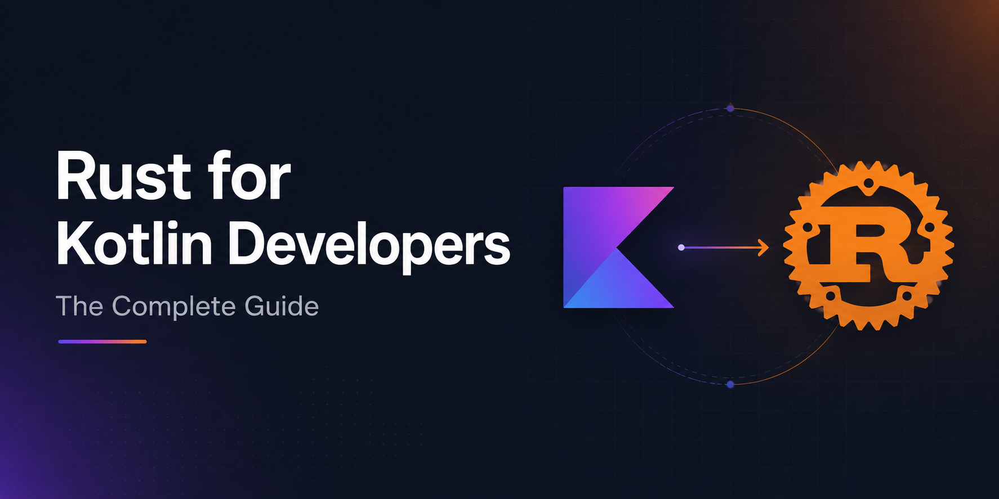

<p align="center">
  
</p>

# Rust for Kotlin Developers — The Complete Guide

<p align="center">
  <a href="https://androidpoet.github.io/rust-for-kotlin-devs/"></a>
  
  
  
  
</p>

<p align="center">
  <b><a href="https://androidpoet.github.io/rust-for-kotlin-devs/">📖 Read this as a searchable docs site →</a></b>
</p>

> A full tour of the Rust language (roughly following [The Rust Book](https://doc.rust-lang.org/book/) and [doc.rust-lang.org](https://doc.rust-lang.org/)), written for someone who already knows Kotlin. Every section shows the Kotlin thing you know, then the Rust equivalent.

**Runnable companion:** every concept has a runnable, clippy-clean file in [`examples/`](examples). Clone the repo and try one:
> ```bash
> cargo run --example 01_ownership
> ```
>
> | Example | Guide § | Example | Guide § |
> |---|---|---|---|
> | `01_ownership` | §10–11 | `10_strings` | §3 |
> | `02_option` | §5 | `11_functions_closures` | §4 |
> | `03_enums_match` | §8–9 | `12_structs` | §6 |
> | `04_result` | §13 | `13_derive` | §7 |
> | `05_traits` | §14 | `14_lifetimes` | §12 |
> | `06_iterators` | §16 | `15_generics` | §15 |
> | `07_async` | §18 | `16_modules` | §17 |
> | `08_variables` | §1 | `17_concurrency` | §19 |
> | `09_types_tuples` | §2 | | |

**The 30-second summary:** Rust will feel like ~50% Kotlin and 50% a new way of thinking. You keep type inference, sealed-class-style enums, pattern matching, lambdas, generics, immutability-by-default, and `Option`/`Result` instead of `null` + exceptions. What's genuinely new: **there is no garbage collector.** Instead the compiler tracks *ownership* and *borrowing* of every value, and *lifetimes* of every reference. There is no class inheritance — you compose behavior with *traits*. Most of your early struggle is with the **borrow checker**, not the syntax. The syntax you'll learn in a day; the ownership model in a week or two.

| Kotlin habit | Rust reality |
|---|---|
| `val` / `var` | `let` / `let mut` — bindings are immutable **by default**, opt into mutation with `mut` |
| GC cleans up for you | **Ownership** — each value has one owner; freed when the owner goes out of scope. No GC. |
| Pass objects freely (shared refs) | **Borrowing** — pass `&T` (shared) or `&mut T` (exclusive); the compiler enforces the rules |
| `fun foo(): Int` | `fn foo() -> i32` — `fn` keyword, return type after `->` |
| `null` + `?.` `?:` `!!` | **No null.** `Option<T>` = `Some(x)` / `None`, unwrapped with `match`, `?`, `.unwrap()`, `if let` |
| Exceptions + `try/catch` | **No exceptions** (for recoverable errors). `Result<T, E>` = `Ok`/`Err`, propagated with `?` |
| `class` + inheritance (`open`/`override`) | `struct` for data, **no inheritance** — share behavior via `trait` (like interfaces with defaults) |
| `sealed class` / `sealed interface` | `enum` — Rust enums carry data per-variant; this is the workhorse type |
| `interface` | `trait` — but also does the job of generics bounds, extensions, and operator overloading |
| `when` | `match` — exhaustive, pattern-based, an expression. Very close, more powerful. |
| Extension functions | `impl` blocks + traits (`impl Trait for Type`) |
| `data class` | `#[derive(Clone, Debug, PartialEq)] struct` — you derive what you want |
| Coroutines + `suspend` | `async`/`.await` + a runtime (`tokio`) — similar shape, you pick the executor |
| Semicolons optional | **Semicolons matter**: a line with `;` is a statement, without `;` it's the returned expression |

---

## 1. Variables

```rust
// Kotlin                              // Rust
val x = 5                              let x = 5;                  // immutable by default
var y = 10                             let mut y = 10;             // opt into mutation with `mut`
y = 20                                 y = 20;

val name: String = "Ada"              let name: String = "Ada".to_string();
```

Two things surprise Kotlin devs:

- **Shadowing is idiomatic.** You can re-declare the same name with a new `let`, even changing its type. This is not mutation — it's a new binding.

```rust
let spaces = "   ";           // &str
let spaces = spaces.len();    // now usize — totally fine, not `mut`
```

- **`const` is compile-time only** and needs a type. There's also `static` for globals. Neither is your everyday tool — `let` is.

```rust
const MAX_POINTS: u32 = 100_000;
```

---

## 2. Built-in types

Rust is explicit about integer width and signedness. There is no single `Int`.

| Kotlin | Rust |
|---|---|
| `Int` | `i32` (default integer) |
| `Long` | `i64` |
| `Short` / `Byte` | `i16` / `i8` |
| unsigned (none) | `u8`, `u32`, `u64`, `usize` (usize = index/length type) |
| `Float` / `Double` | `f32` / `f64` (default float) |
| `Boolean` | `bool` |
| `Char` | `char` (a full Unicode scalar, 4 bytes — not a UTF-16 unit) |
| `String` | `String` (owned, growable) **and** `&str` (borrowed string slice) — see §3 |
| `List<T>` | `Vec<T>` (growable) and `[T; N]` (fixed array), `&[T]` (slice) |
| `Map<K,V>` | `HashMap<K, V>` (from `std::collections`) |
| `Pair`/`Triple` | tuples: `(i32, String)`, `(a, b, c)` |
| `Unit` | `()` (the unit type) |
| `Nothing` | `!` (the never type) |

```rust
let sum: i64 = 1_000_000 * 2;
let tuple: (i32, f64, char) = (500, 6.4, 'z');
let (a, b, c) = tuple;            // destructuring, like Kotlin
let first = tuple.0;             // tuple index access
```

Integer overflow **panics in debug builds** and wraps in release — use `wrapping_add`, `checked_add`, `saturating_add` when you mean it.

---

## 3. Strings — the one that trips everyone up

Kotlin has one `String`. Rust has two you'll use constantly:

- `String` — owned, heap-allocated, growable. Like `StringBuilder`-meets-`String`.
- `&str` — a *borrowed* view into string data (a "string slice"). String literals are `&str`.

```rust
// Kotlin                              // Rust
val s = "hello"                        let s: &str = "hello";              // literal is &str
val owned = buildString { ... }       let owned: String = "hello".to_string();
                                       let owned = String::from("hello");
```

You take `&str` as a function parameter (accepts both), return `String` when you own the data.

**String interpolation** looks familiar but only takes simple names by default:

```rust
let name = "Ada";
let age = 36;
println!("{name} is {age}");                 // inline capture (Rust 2021+)
println!("{} is {}", name, age);            // positional
let msg = format!("{name} is {age}");        // returns a String
```

Indexing by integer (`s[0]`) is **not allowed** — bytes vs chars vs graphemes are genuinely ambiguous in UTF-8. Iterate instead:

```rust
for c in "héllo".chars() { /* ... */ }
let bytes = "hi".as_bytes();
```

---

## 4. Functions

```rust
// Kotlin                              // Rust
fun add(a: Int, b: Int): Int {         fn add(a: i32, b: i32) -> i32 {
    return a + b                           a + b          // no `;`, no `return` — last expression is returned
}                                      }
```

**The single biggest syntax idea in Rust:** blocks are expressions. The final line *without* a semicolon is the block's value.

```rust
let y = {
    let x = 3;
    x + 1        // no semicolon → this block evaluates to 4
};
```

`return` exists but is mostly for early exit. Everything else "falls out" the bottom.

Closures (lambdas):

```rust
// Kotlin: { a, b -> a + b }
let add = |a, b| a + b;
let nums: Vec<i32> = (1..=5).map(|x| x * 2).collect();
```

---

## 5. No null — `Option<T>`

Rust has no `null`. Absence is a value of type `Option<T>`:

```rust
enum Option<T> { Some(T), None }
```

```rust
// Kotlin                              // Rust
val name: String? = null               let name: Option<String> = None;
val name: String? = "Ada"             let name: Option<String> = Some("Ada".to_string());
```

Handling it — several ergonomic tools that map onto Kotlin habits:

```rust
// Kotlin: name?.length                     // map over Some
let len: Option<usize> = name.map(|n| n.len());

// Kotlin: name ?: "default"                 // provide a fallback
let n = name.unwrap_or("default".to_string());
let n = name.unwrap_or_else(|| expensive());

// Kotlin: name!!                            // assert non-null (panics if None)
let n = name.unwrap();          // or .expect("name must be set")

// Kotlin: if (name != null) { use(name) }   // smart-cast style
if let Some(n) = &name {
    println!("{n}");
}
```

`?` also works on `Option` inside a function returning `Option` — early-returns `None`.

---

## 6. Structs & "constructors"

There's no `class`. Data lives in `struct`s; behavior lives in `impl` blocks.

```rust
// Kotlin
data class User(val name: String, var age: Int)

// Rust
#[derive(Debug, Clone)]
struct User {
    name: String,
    age: u32,        // fields are private to the module by default; add `pub` to expose
}

impl User {
    // associated function = "constructor" by convention, named `new`
    fn new(name: String, age: u32) -> Self {
        User { name, age }        // field init shorthand, like Kotlin
    }

    // method: takes `&self` (borrow), `&mut self` (mutable borrow), or `self` (consume)
    fn greet(&self) -> String {
        format!("Hi, I'm {}", self.name)
    }

    fn have_birthday(&mut self) {
        self.age += 1;
    }
}

let mut u = User::new("Ada".into(), 36);
println!("{}", u.greet());
u.have_birthday();
```

Key differences from Kotlin:

- No primary-constructor sugar — you write `fn new`. It's just a convention, not a keyword.
- `self`/`&self`/`&mut self` is explicit and **matters**: it declares whether the method reads, mutates, or consumes the receiver.
- Other struct shapes: **tuple structs** `struct Point(i32, i32);` and **unit structs** `struct Marker;`.

---

## 7. `data class` → derive macros

The Kotlin `data class` freebies (`equals`, `hashCode`, `toString`, `copy`) are opt-in via `#[derive(...)]`:

```rust
#[derive(Debug, Clone, PartialEq, Eq, Hash)]
struct Point { x: i32, y: i32 }

let a = Point { x: 1, y: 2 };
let b = a.clone();               // ~ Kotlin copy() (clone is the general mechanism)
assert_eq!(a, b);                // PartialEq gives ==
println!("{a:?}");               // Debug gives a printable form ({:?})

// struct update syntax ≈ copy(x = 9)
let c = Point { x: 9, ..a };
```

| Kotlin data class gives you | Rust derive |
|---|---|
| `equals`/`hashCode` | `PartialEq, Eq, Hash` |
| `toString` | `Debug` (`{:?}`) and/or `Display` (hand-written, `{}`) |
| `copy()` | `Clone` + struct update syntax `{ ..old }` |
| `componentN` destructuring | pattern destructuring `let Point { x, y } = p;` |

---

## 8. Enums — the sealed class you always wanted

Kotlin `sealed class` and Rust `enum` are the same idea, but enums are *the* central Rust type and are far lighter to write:

```kotlin
// Kotlin
sealed interface Shape
data class Circle(val r: Double) : Shape
data class Rect(val w: Double, val h: Double) : Shape
object Empty : Shape
```

```rust
// Rust — one declaration, variants carry data
enum Shape {
    Circle { r: f64 },
    Rect(f64, f64),
    Empty,
}

impl Shape {
    fn area(&self) -> f64 {
        match self {
            Shape::Circle { r } => std::f64::consts::PI * r * r,
            Shape::Rect(w, h) => w * h,
            Shape::Empty => 0.0,
        }
    }
}
```

`Option<T>` and `Result<T, E>` are just enums from the standard library. Once enums click, most of Rust clicks.

---

## 9. Pattern matching — `when` → `match`

```rust
// Kotlin `when`                        // Rust `match` — exhaustive, an expression
val label = when (n) {                  let label = match n {
    0 -> "zero"                             0 => "zero",
    1, 2 -> "small"                         1 | 2 => "small",
    in 3..10 -> "medium"                    3..=10 => "medium",
    else -> "big"                           _ => "big",
}                                       };
```

`match` must be **exhaustive** — the compiler forces you to handle every case (or `_`). It destructures deeply:

```rust
match shape {
    Shape::Circle { r } if *r > 10.0 => println!("big circle"),   // guard
    Shape::Rect(w, h) => println!("{w}x{h}"),
    other => println!("{:?}", other),
}
```

Lightweight forms for one case — the Kotlin `if`-smart-cast replacements:

```rust
if let Some(x) = maybe { use_it(x); }
let Some(x) = maybe else { return; };    // let-else: bind or bail
while let Some(item) = stack.pop() { /* ... */ }
```

---

## 10. Ownership — the actual new thing

This is the concept with no Kotlin equivalent. Read it slowly.

**Rule 1: every value has exactly one owner.** When the owner goes out of scope, the value is dropped (freed). No GC, no reference counting by default.

```rust
let s1 = String::from("hi");
let s2 = s1;              // ownership MOVES to s2
// println!("{s1}");     // ❌ compile error: s1 was moved, it's no longer valid
```

For heap types (`String`, `Vec`, boxed data), assignment/passing is a **move**, not a copy. `s1` is invalidated so two owners can't both free it. Small `Copy` types (`i32`, `bool`, `char`, tuples of them) are *copied* instead, so this feels normal:

```rust
let a = 5;
let b = a;               // copied — both a and b are valid
```

**Passing to a function moves it too** unless you borrow (next section) or `.clone()`:

```rust
fn consume(s: String) { /* s dropped here */ }
let s = String::from("hi");
consume(s);
// s is gone now; use consume(s.clone()) to keep a copy
```

Mental model: think of every non-`Copy` value like a unique resource (a file handle, a mutex guard). You wouldn't want two owners each closing it.

---

## 11. Borrowing & references — passing without giving away

Moving everywhere would be painful, so you **borrow** with references. Two kinds:

```rust
fn len(s: &String) -> usize { s.len() }        // &  = shared/immutable borrow
fn push(s: &mut String) { s.push('!'); }       // &mut = exclusive/mutable borrow

let mut s = String::from("hi");
let n = len(&s);         // lend a read-only view; s still owned here
push(&mut s);            // lend a mutable view
```

**The borrow-checker rules** (the source of most early compile errors):

1. You can have **any number of `&` shared borrows**, OR **exactly one `&mut`** — never both at the same time.
2. A reference must never outlive the data it points to (no dangling pointers).

```rust
let mut v = vec![1, 2, 3];
let first = &v[0];       // shared borrow
v.push(4);               // ❌ needs &mut while `first` is still borrowing — compile error
println!("{first}");
```

This is Kotlin's "don't mutate a list while iterating it" turned into a compile-time guarantee across your whole program. It's *aliasing XOR mutability*: data can be shared or mutable, never both at once. This is also why Rust is data-race-free by construction.

When single ownership genuinely won't do (a value shared in many places), you reach for **`Rc<T>`** (shared ownership, single-thread) or **`Arc<T>`** (atomic, thread-safe), often with **`RefCell`/`Mutex`** for interior mutability — the closest thing to Kotlin's freely-shared references, made explicit.

---

## 12. Lifetimes — usually invisible, occasionally explicit

Lifetimes are how the compiler proves rule 2 (no dangling references). Most of the time they're **inferred** and you write nothing. You only annotate when a function returns a reference and the compiler can't tell which input it borrows from:

```rust
// "the returned &str lives as long as both inputs"
fn longest<'a>(x: &'a str, y: &'a str) -> &'a str {
    if x.len() > y.len() { x } else { y }
}
```

`'a` is a *lifetime parameter* — a label, not a duration you pick. Don't fight to understand these on day one; you'll meet them when you need them, and the error message usually tells you what to write.

---

## 13. Error handling — `Result<T, E>`, not exceptions

Rust splits errors in two:

- **Unrecoverable** → `panic!` (bugs, broken invariants). Unwinds/aborts. Like an uncaught exception, but you don't design around catching it.
- **Recoverable** → `Result<T, E>`, an ordinary value you must handle.

```rust
enum Result<T, E> { Ok(T), Err(E) }
```

```rust
// Kotlin                                       // Rust
fun read(): String { /* throws IOException */ } fn read() -> Result<String, io::Error> { ... }

try {                                           match read() {
    val s = read()                                  Ok(s) => use_it(s),
    use(s)                                          Err(e) => eprintln!("{e}"),
} catch (e: IOException) { ... }                }
```

**The `?` operator** is the killer feature — it's "unwrap-or-return-the-error", turning verbose matching into a clean happy path:

```rust
fn load() -> Result<Config, io::Error> {
    let text = fs::read_to_string("config.toml")?;   // if Err, return it now
    let cfg = parse(&text)?;                          // same
    Ok(cfg)
}
```

`?` is roughly Kotlin's checked-exception propagation, but visible and type-checked at every call site. Crates like `anyhow` (apps) and `thiserror` (libraries) make error types ergonomic.

---

## 14. Traits — interfaces, extensions, and generics bounds in one

Rust has **no inheritance.** `trait` is the single tool for shared behavior — it's Kotlin's `interface` (with default methods), extension functions, and operator overloading combined.

```rust
// Kotlin interface with default method
trait Greet {
    fn name(&self) -> String;                 // required
    fn hello(&self) -> String {               // default method
        format!("Hello, {}", self.name())
    }
}

struct Dog;
impl Greet for Dog {
    fn name(&self) -> String { "Rex".into() }
}
```

Because traits can be implemented for *any* type (even ones you didn't define, like adding a method to `i32`), they double as **extension functions**:

```rust
trait Doubler { fn double(&self) -> Self; }
impl Doubler for i32 { fn double(&self) -> i32 { self * 2 } }
let x = 21.double();     // 42
```

Common derivable/standard traits worth knowing early: `Debug`, `Clone`, `Copy`, `PartialEq`/`Eq`, `Default`, `From`/`Into`, `Iterator`, `Display`.

---

## 15. Generics

Nearly identical to Kotlin, with `where`-clause bounds:

```rust
// Kotlin: fun <T : Comparable<T>> max(list: List<T>): T
fn largest<T: PartialOrd + Copy>(list: &[T]) -> T {
    let mut max = list[0];
    for &item in list { if item > max { max = item; } }
    max
}

// longer form
fn print_all<T>(items: &[T]) where T: std::fmt::Display { /* ... */ }
```

- Trait bounds (`T: PartialOrd`) are Kotlin's generic constraints (`T : Comparable<T>`).
- `impl Trait` in argument/return position ≈ Kotlin's use of an interface type without naming the generic.
- Rust generics are **monomorphized** (zero-cost, specialized per type at compile time) — no reflection, no type erasure.

---

## 16. Collections & iterators

`Vec<T>` and `HashMap<K,V>` are your `MutableList`/`MutableMap`. The iterator chains will feel *very* familiar:

```rust
// Kotlin
val evens = (1..10).filter { it % 2 == 0 }.map { it * it }

// Rust — lazy iterators, terminated by a "collect"/consume
let evens: Vec<i32> = (1..=10)
    .filter(|x| x % 2 == 0)
    .map(|x| x * x)
    .collect();
```

| Kotlin | Rust |
|---|---|
| `.map { }` | `.map(|x| ...)` |
| `.filter { }` | `.filter(|x| ...)` |
| `.forEach { }` | `.for_each(...)` or a `for` loop |
| `.fold(0) { acc, x -> }` | `.fold(0, |acc, x| ...)` |
| `.sumOf { }` | `.map(...).sum()` |
| `.firstOrNull { }` | `.find(...)` → returns `Option` |
| `.groupBy { }` | manual with `HashMap`, or the `itertools` crate |
| `.sortedBy { }` | `.sort_by_key(...)` (in place, on a `Vec`) |

Iterators are **lazy** — nothing runs until a consuming call (`collect`, `sum`, `for`, `count`). `.iter()` borrows, `.into_iter()` consumes, `.iter_mut()` gives mutable refs.

---

## 17. Modules, visibility & packages

```rust
// A "crate" = a package (a lib or binary). Cargo.toml is your build.gradle.
mod network {                    // module, like a Kotlin package/file boundary
    pub fn connect() {}          // `pub` = public; private by default
    mod internal { }             // nested, private
}

use network::connect;           // like Kotlin import
connect();
```

| Kotlin | Rust |
|---|---|
| `internal` / private (default is public!) | **private by default**, `pub` to expose |
| package | `mod` (modules) + crate |
| Gradle module / artifact | crate |
| `build.gradle`, Maven Central | `Cargo.toml`, [crates.io](https://crates.io) |
| `import foo.Bar` | `use foo::Bar;` |

Note the polarity flip: Kotlin is public-by-default, Rust is **private-by-default**.

---

## 18. Async — `suspend` → `async`/`.await`

The shape is similar to coroutines, but Rust doesn't ship a runtime — you add one (almost always **`tokio`**).

```rust
// Kotlin
suspend fun fetch(): String { ... }
val data = fetch()

// Rust
async fn fetch() -> String { ... }
let data = fetch().await;             // .await is a postfix operator
```

```rust
#[tokio::main]                        // sets up the executor, like a coroutine scope
async fn main() {
    let (a, b) = tokio::join!(fetch_a(), fetch_b());   // ~ awaitAll / coroutineScope
}
```

Key differences from coroutines:

- `async fn` returns a **`Future`** that is *lazy* — it does nothing until `.await`ed or spawned (Kotlin coroutines are eager once launched).
- No built-in `Dispatchers` / structured concurrency — the runtime (tokio) provides `spawn`, `join!`, `select!`, channels.
- `.await` is postfix (`x.await`) and chains cleanly.

---

## 19. Concurrency & the `Send`/`Sync` guarantee

Kotlin relies on you to avoid data races. Rust makes them a **compile error** via the same ownership rules plus two marker traits:

- `Send` — safe to move to another thread.
- `Sync` — safe to share (`&T`) across threads.

```rust
use std::thread;
use std::sync::{Arc, Mutex};

let counter = Arc::new(Mutex::new(0));       // shared, thread-safe ownership
let mut handles = vec![];
for _ in 0..10 {
    let c = Arc::clone(&counter);
    handles.push(thread::spawn(move || {     // `move` transfers ownership into the thread
        *c.lock().unwrap() += 1;
    }));
}
for h in handles { h.join().unwrap(); }
```

The famous slogan **"fearless concurrency"**: if it compiles, it has no data races. That's the payoff for the borrow checker.

---

## 20. Tooling crash course

| Task | Kotlin/Gradle | Rust/Cargo |
|---|---|---|
| New project | IDE / `gradle init` | `cargo new my_app` |
| Build | `./gradlew build` | `cargo build` (`--release` for optimized) |
| Run | `./gradlew run` | `cargo run` |
| Test | `./gradlew test` | `cargo test` |
| Add dependency | edit `build.gradle` | `cargo add serde` (edits `Cargo.toml`) |
| Format | ktlint / spotless | `cargo fmt` (rustfmt — one canonical style) |
| Lint | detekt | `cargo clippy` — genuinely excellent, run it constantly |
| Docs | Dokka | `cargo doc --open` |
| REPL | Kotlin REPL | none official; use [play.rust-lang.org](https://play.rust-lang.org) |

`clippy` is the single best learning tool — it suggests idiomatic rewrites. Install everything via **`rustup`** (the toolchain manager, like sdkman for Rust).

Write tests inline, in the same file:

```rust
#[cfg(test)]
mod tests {
    use super::*;
    #[test]
    fn it_adds() { assert_eq!(add(2, 2), 4); }
}
```

---

## 21. Idiom translation cheat sheet

| Kotlin | Rust |
|---|---|
| `val x = 5` | `let x = 5;` |
| `var x = 5` | `let mut x = 5;` |
| `x?.foo() ?: default` | `x.map(\|v\| v.foo()).unwrap_or(default)` |
| `x!!` | `x.unwrap()` / `x.expect("msg")` |
| `x ?: return` | `let Some(x) = x else { return; };` |
| `if (x != null) { ... }` | `if let Some(x) = x { ... }` |
| `when (x) { ... }` | `match x { ... }` |
| `data class` | `#[derive(Clone, Debug, PartialEq)] struct` |
| `sealed class` | `enum` (variants carry data) |
| `object` (singleton) | module-level fns, or a `static`, or `Lazy` |
| `companion object` | `impl` block with associated fns (`Type::new`) |
| `interface` | `trait` |
| `class Foo : Bar()` (inheritance) | composition + `trait` (no inheritance) |
| extension fun | `impl SomeTrait for Type` |
| `lazy { }` | `once_cell::Lazy` / `std::sync::OnceLock` |
| `require()` / `check()` | `assert!` / `debug_assert!` / return `Err` |
| `throw` | `return Err(...)` (recoverable) or `panic!` (bug) |
| `try/catch` | `match` on `Result`, or `?` to propagate |
| `List<T>` (read-only) | `&[T]` (slice) |
| `MutableList<T>` | `Vec<T>` |
| `Map<K,V>` | `HashMap<K,V>` |
| `to`/`Pair` | tuple `(a, b)` |
| `.let { }` | `let` binding, or `.map()` on Option |
| `.also { }` | `{ let _ = &x; ... x }` / `inspect` (iterators) |
| `.apply { }` | build the struct directly (fields are explicit) |
| `buildString { }` | `let mut s = String::new(); s.push_str(...);` |

---

## 22. Things Rust has that Kotlin doesn't

- **Ownership & the borrow checker** — memory and data-race safety with *no garbage collector* and no runtime cost.
- **Real zero-cost abstractions** — iterators, generics, and `async` compile down to hand-written-speed code (monomorphization, no type erasure).
- **Enums with data as the default modeling tool** — lighter than sealed hierarchies, exhaustively matched.
- **`?` for both `Option` and `Result`** — uniform, explicit propagation.
- **Powerful pattern matching** — guards, ranges, bindings, nested destructuring, `let`-`else`.
- **Hygienic macros** (`println!`, `vec!`, `derive`) — code generation without annotation processors/KAPT.
- **One canonical formatter and a world-class linter** (`rustfmt`, `clippy`) built in.
- **Compiles to a single static native binary** — no JVM, tiny footprint, great for CLIs, WASM, and embedded.

## 23. Things you'll miss from Kotlin

- **The GC.** Not thinking about ownership at all. Building a graph/doubly-linked list is a *lesson* in Rust, not a one-liner.
- **`data class` one-liners** and `copy()` — Rust needs derives and struct-update syntax.
- **Inheritance & `open`/`override`** — you'll restructure designs around composition and traits.
- **Scope functions** (`let`/`run`/`apply`/`also`/`with`) — no direct equivalents; you write plain code.
- **Effortless shared mutable state** — every `Rc<RefCell<T>>` reminds you it isn't free.
- **Fast incremental compiles** — Rust builds are slower; `cargo check` and keeping crates small helps.
- **`null` + `?.` terseness** — `Option` is safer but chattier until the combinators become muscle memory.
- **A batteries-included stdlib for web/JSON** — Rust leans on crates (`serde`, `reqwest`, `tokio`), which is idiomatic but more assembly-required.

---

## 24. A 7-day learning plan

**Day 1 — Syntax & bindings.** Install `rustup`, `cargo new`. Learn `let`/`mut`, functions, `if`/`loop`/`for`, expressions-vs-statements (the semicolon rule). Do [Rustlings](https://github.com/rust-lang/rustlings) `variables`, `functions`, `if`.

**Day 2 — Ownership.** The single most important day. Read [The Book, Ch. 4](https://doc.rust-lang.org/book/ch04-00-understanding-ownership.html). Understand move vs copy vs clone, then borrowing (`&`, `&mut`) and the aliasing-XOR-mutability rule. Rustlings `move_semantics`.

**Day 3 — Structs, enums, `match`.** Model data. `impl` methods, `Option`, exhaustive `match`, `if let`/`let else`. This is where your Kotlin `sealed class`/`when` intuition pays off. Rustlings `structs`, `enums`, `options`.

**Day 4 — Error handling & traits.** `Result`, the `?` operator, `panic!` vs recoverable errors. Then `trait`s: default methods, `impl Trait for Type`, derives. Rustlings `error_handling`, `traits`.

**Day 5 — Generics, collections, iterators.** `Vec`, `HashMap`, and the iterator chains (`map`/`filter`/`collect`/`fold`). Generic functions with trait bounds. Rustlings `generics`, `iterators`, `hashmaps`.

**Day 6 — Modules, tooling, a small project.** `mod`/`use`/`pub`, `Cargo.toml`, `cargo add`. Build a small CLI (a to-do list or a word counter). Run `cargo clippy` and read every suggestion.

**Day 7 — Async or a real crate.** Either learn `async`/`.await` with `tokio` (`reqwest` to hit an API, `serde` to parse JSON), or deepen ownership with `Rc`/`Arc`/`RefCell`. Read others' idiomatic code.

**Bookmark these:**
- [The Rust Book](https://doc.rust-lang.org/book/) — the canonical, excellent tutorial
- [Rustlings](https://github.com/rust-lang/rustlings) — hands-on compiler-driven exercises
- [Rust by Example](https://doc.rust-lang.org/rust-by-example/) — runnable snippets
- [The Rust Playground](https://play.rust-lang.org) — try things instantly
- [Comprehensive Rust (Google)](https://google.github.io/comprehensive-rust/) — course-format, great for experienced devs
- [std docs](https://doc.rust-lang.org/std/) — searchable, always the source of truth

---

*Bottom line: the syntax is a weekend. The real curriculum is ownership — spend Day 2 there and re-read it Day 5. Once you stop fighting the borrow checker and start hearing it as "you're aliasing mutable state, and I won't let that be a bug," Rust becomes the language that catches your mistakes at compile time instead of 3 AM in production. Lean on `clippy`, model everything with enums, and reach for `.clone()` without guilt while you're learning — you can optimize the borrows later.*
